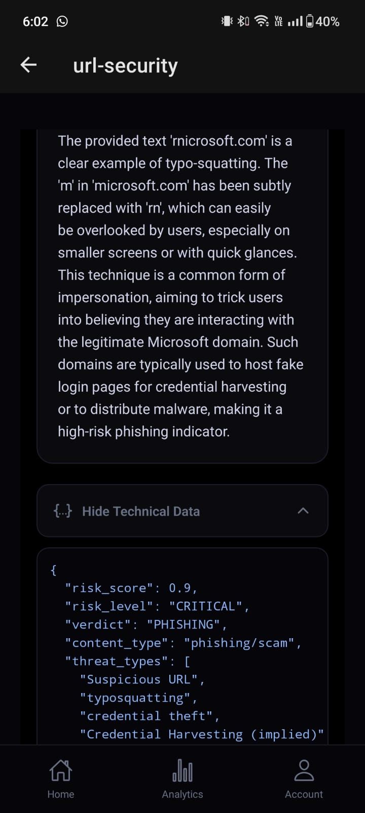
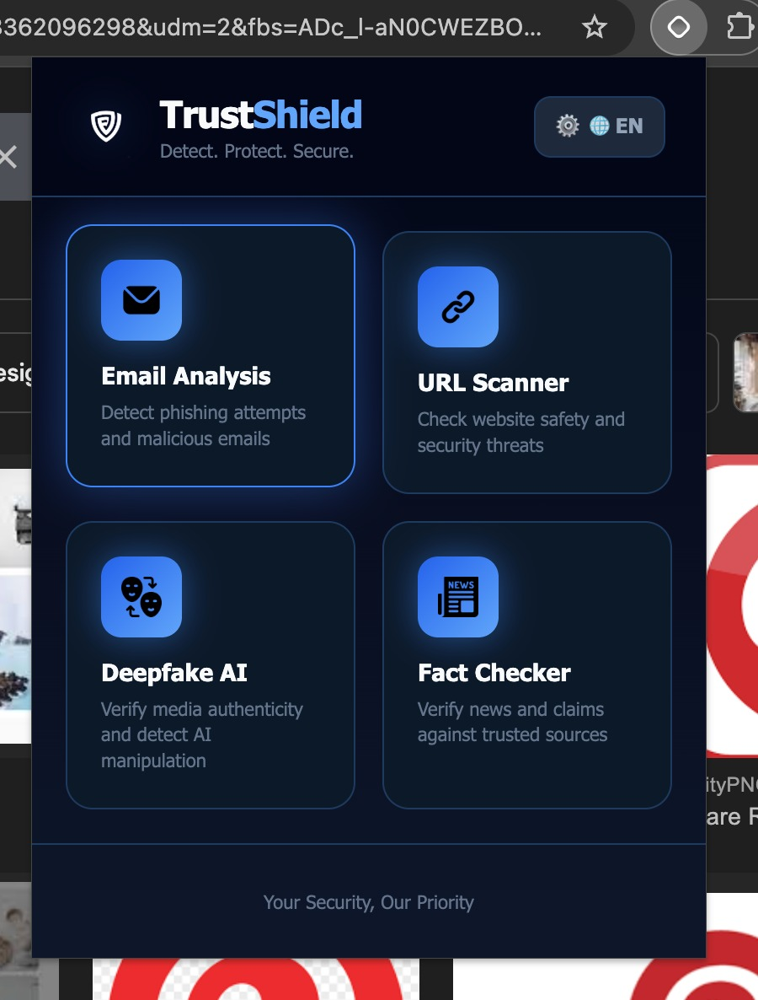
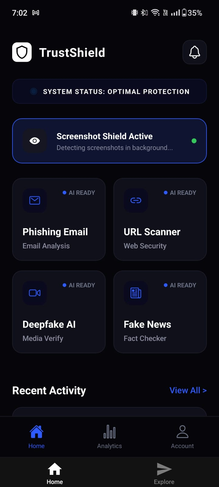
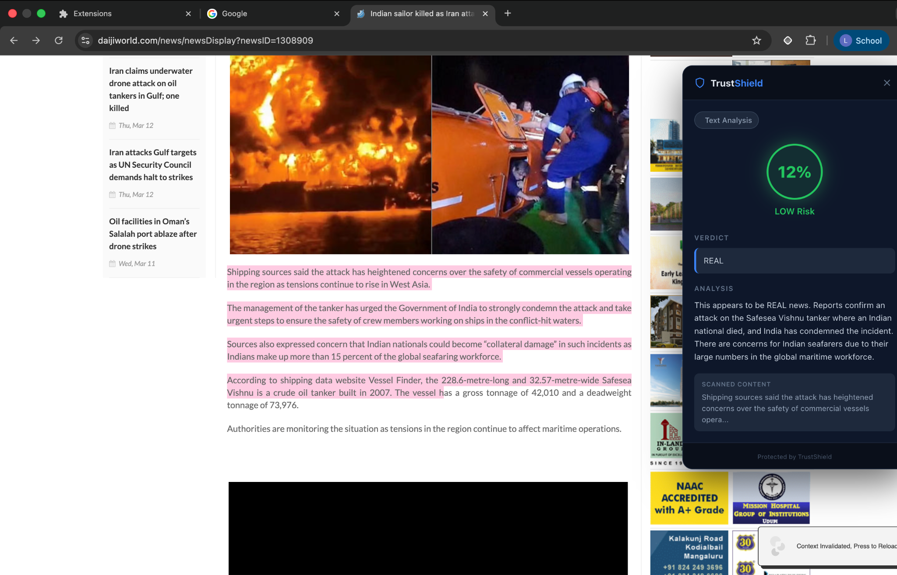
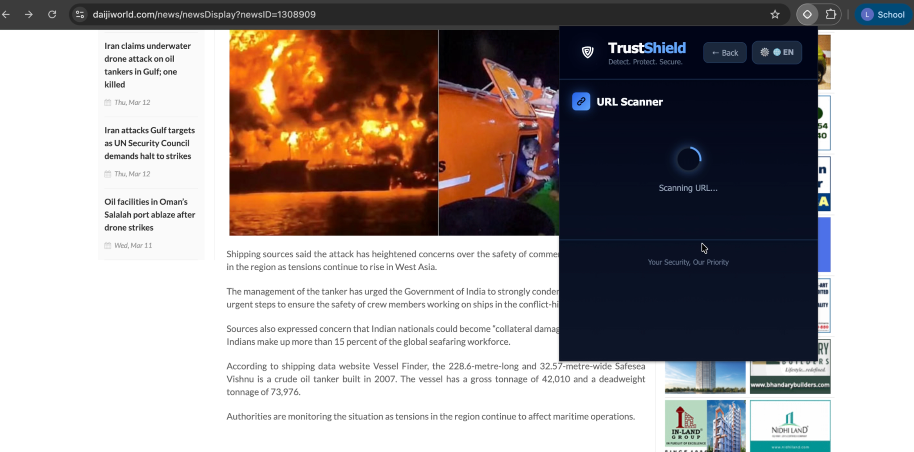

# TrustShield by Runtime Terrors

## Introduction
TrustShield is a comprehensive cybersecurity solution built to detect and neutralize digital threats in real time. We rely on artificial intelligence, specifically Retrieval Augmented Generation and Google Search Grounding, to protect people from advanced AI based scams like phishing, vishing, and deepfakes. Our goal is to provide a seamless defense across calls, messages, emails, and internet browsing.

## Description
The digital landscape has become increasingly sophisticated. It is no longer just about suspicious emails. Today, people are constantly exposed to vishing, which is voice phishing using AI generated voices. They also face highly sophisticated phishing emails that bypass normal spam filters, deepfake media that spreads misinformation, and malicious links disguised as legitimate websites.

Our primary focus is to protect vulnerable groups, especially the elderly who are often the target of social engineering attacks, as well as corporate workers who manage sensitive data. Current security solutions are often restricted by limits on how often they can be used, lack integration, and usually only react after a threat has appeared. TrustShield is designed to be proactive and unified.

## Core Features
Our platform provides a security layer built right into the tools you use every day. 

Smart Extension
You can highlight any text or web link on a page, and our scanner will instantly check it for misinformation or signs of phishing.

Live Call Monitoring
During a phone call, TrustShield analyzes the audio in background batches of five seconds. It actively looks for deepfake voice manipulation without interrupting your conversation.

Email Protection
We scan your inbox to catch sender spoofing, verify who is really emailing you, and check any attachments for malicious code.

Visual Deepfake Detection
If you come across a questionable image online, you can upload a screenshot to our dashboard, and we will verify if it has been artificially generated.

Unified Dashboard
Everything comes together in our mobile app, serving as your central hub to review scans, alerts, and safety reports.

## How to Use
Using TrustShield is simple and designed to stay out of your way. 

For browsing the web, you can install our smart extension and simply highlight any text or links that seem suspicious. The system will give you a quick reading on its safety. 

For phone calls, you just need to have the mobile app actively monitoring in the background. It handles the audio processing silently while you talk and will notify you via email or on screen alerts if it detects a deepfake voice. 

For manual verification, you can always open the TrustShield dashboard to view your safety score, check detailed reports, or manually upload screenshots and files to be analyzed by our detection models.

## Visual Gallery
Here is a look at the application interface and features. 

  
  
  

 

  
  

